# GuideBook Data Science

This is a solution for the [Guidebook Data Science Intern Challenge
](https://github.com/Guidebook/code-challenges/blob/master/data-science/data_science_intern_challenge.md)

## Part 1

For part 1 please reference the python script in the [process_data.py](https://github.com/PatrickCmd/GuideBook-Data-Science/blob/main/process_data.py) file.

## Part 2
From part 1, I created functions that can be referenced for data processing and generating a dataset together with  a python dataframe.

Data Processing

```python
from input_data import INPUT_DATA


# Data processing
user_events = events_per_user(INPUT_DATA)
user_events_triggers = user_events_trigger_count(user_events)
user_event_times = user_event_times_count(user_events_triggers)
```

Generating Dataset

```python
# generating dataset
user_events_ds = generate_user_events_dataset(user_event_times)
```

Getting pandas dataframe from generated dataset

```python
df = generate_dataframe(user_events_ds)
```

The above gives a dataframe of the form as below

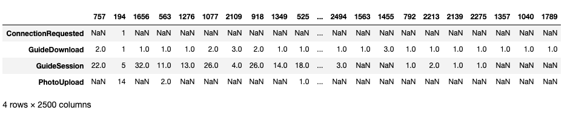

As we see above, the dataframe has a lot of NaN (Not a Number) values, which I think this means users who have not interracted with the different events in the guide.

Also we that the shape of the dataframe is (4, 2500) i.e 4 rows and 2500 columns. Here I transpose the dataframe in the next step for rows to be columns and viseversa.

Transposing the dataframe
```python
df = df.T  # Transpose the dataframe
df
```

Gives a new dataframe of the form

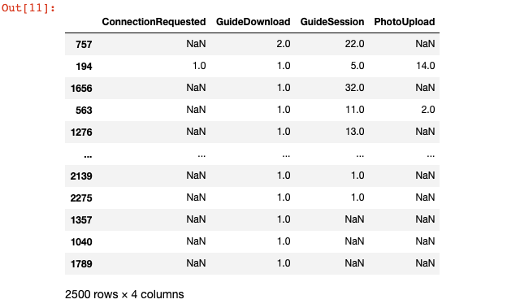

Doing a bit more cleaning on the dataframe

```python
df.fillna(0, inplace=True)  # Filling NaN values with 0
df = df.astype('int64')
df
```

Replace NaN with 0, simply means that a users hasn't triggered that event.

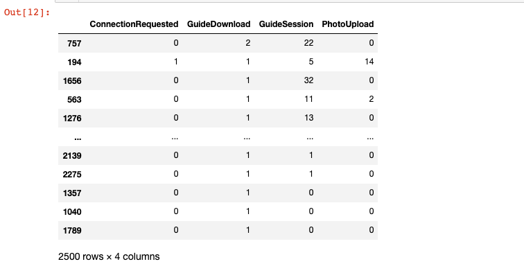

## Learning more about the data

```python
df.shape  # no. of rows and columns in dataframe
```

Gives: (2500, 4), which means; The size of the dataframe is (2500, 4) i.e 2500 rows and 4 columns

```python
df.head(10)  # TO display the top 10 rows
```

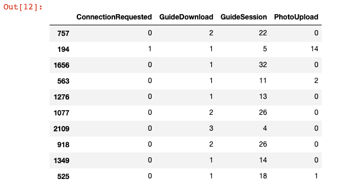

```python
df.tail(10)  # TO display the last 10 rows
```

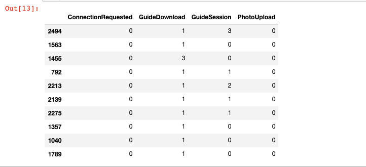

## Exploration and Discussion (PhotoUpload Event)

Taking a closer look at the PhotoUpload event and doing some explorations

Getting descriptive statistics about the PhotoUpload event.

```python
df["PhotoUpload"].describe()
```

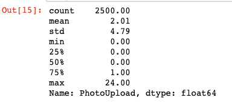

We see that also more users have never triggered the photoupload event

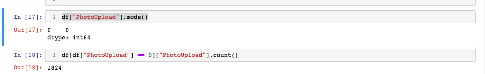

Plotting a histogram to get an over view of how the data is distributed with the photo upload event.

```python
import seaborn as sns
# sns.set()
photoupload_data = df['PhotoUpload']
sns.histplot(photoupload_data, binwidth = 3).set_title('User PhotoUpload Event Triggers')
plt.show()
```

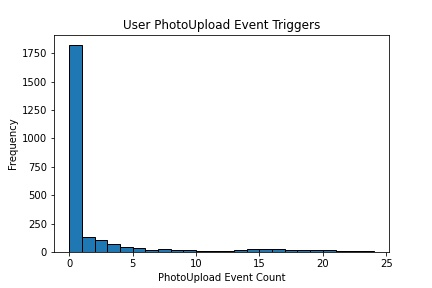

From the graph above it clearly shows that the photo upload feature is triggered by a few users. The highest bar on the left clearly shows that very many users have never used the
photoupload event.

### PhotoUpload Profiling

First install the pandas profiling module
```
pip install pandas-profiling
```

```python
from pandas_profiling import ProfileReport

profile = ProfileReport(df, title="Pandas Profiling Report")
profile
```

With some simple profiling, we get these results;

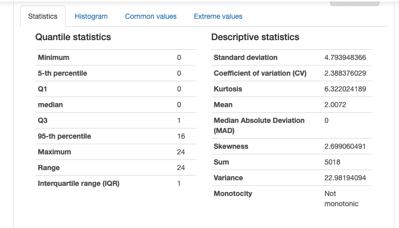

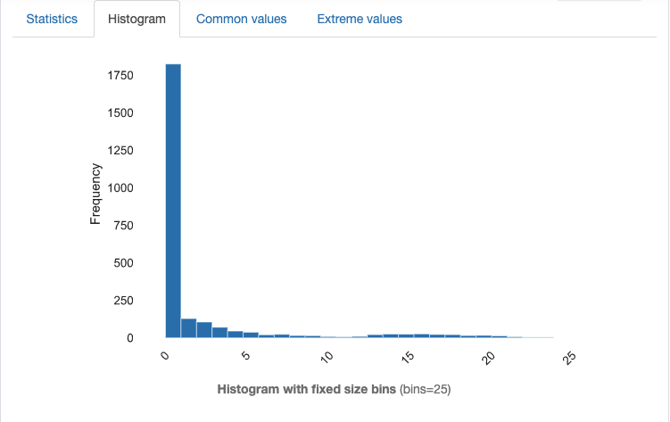

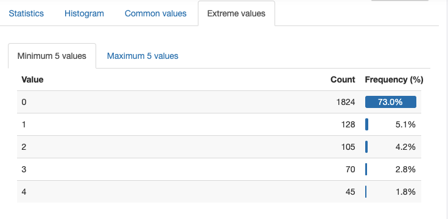

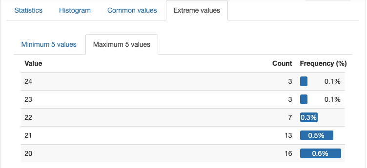

From the profiling statistics of the photo upload event, it clearly shows that very few users trigger the photoupload event. 1824(73.0%) users have never triggered the photoupload event, 128 (5.1%) have triggered it only once, 105 (4.2%) have triggered it twice, 70 (2.8%) have triggered it thrice, 45 (1.8%) have triggered it four times. Again looking at how many users have triggered the photoupload event more than 20 times, the number is very small. 16 (0.6%) users have triggered it 20 times, 13 (0.5%) have triggered it 21 times, 7 (0.5%) have triggered it 22 times, 3 (0.1%) users have it 23 and 24 times.

## Conclusion

Conclusively, statistics shows that a few users trigger or really interract with the photo upload event in our guide.


# Reference
1. [GuideBook DataScience Challenge](https://github.com/Guidebook/code-challenges/blob/master/data-science/data_science_intern_challenge.md)
2. [Python Script for Data processing](https://github.com/PatrickCmd/GuideBook-Data-Science/blob/main/process_data.py)
3. [Jupyter NoteBook](https://github.com/PatrickCmd/GuideBook-Data-Science/blob/main/Guide%20Book%20Data%20Science%20Refactor.ipynb)